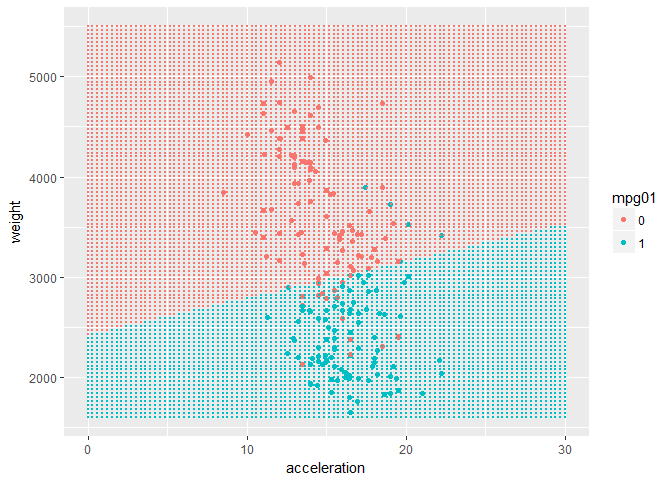

##### 1. The Titanic dataset records for each person on the ship the passenger class, age (child or adult), and sex, and whether they survived or not.In this assignment you will use logistic regression on a training set (ttrain) to develop a classification rule, and then this rule will be applied to the test set (ttest).

    setwd("E:/maynooth/2nd_sem/ST464StatisticalMachineLearning/assignment/3")
    ttrain <- read.csv("ttrain.csv", header=T, row.names=1)
    ttest <- read.csv("ttest.csv", header=T, row.names=1)
    head(ttrain)

    ##      Class    Sex   Age Survived
    ## 633    3rd   Male Adult       No
    ## 1735  Crew   Male Adult      Yes
    ## 900   Crew   Male Adult       No
    ## 1941   1st Female Adult      Yes
    ## 2067   2nd Female Adult      Yes
    ## 101    1st   Male Adult       No

    attach(ttrain)

##### (a) Use logistic regression to build a model relating Survived to Class Age and Sex for the training data ttrain.

    lfit <- glm(Survived~Sex+Age+Class,family="binomial",data=ttrain)
    summary(lfit)

    ## 
    ## Call:
    ## glm(formula = Survived ~ Sex + Age + Class, family = "binomial", 
    ##     data = ttrain)
    ## 
    ## Deviance Residuals: 
    ##     Min       1Q   Median       3Q      Max  
    ## -2.1232  -0.7173  -0.4496   0.6768   2.1642  
    ## 
    ## Coefficients:
    ##             Estimate Std. Error z value Pr(>|z|)    
    ## (Intercept)   2.1431     0.1922  11.153  < 2e-16 ***
    ## SexMale      -2.5373     0.1606 -15.795  < 2e-16 ***
    ## AgeChild      1.0606     0.2889   3.671 0.000242 ***
    ## Class2nd     -1.0136     0.2219  -4.567 4.95e-06 ***
    ## Class3rd     -1.8467     0.1952  -9.462  < 2e-16 ***
    ## ClassCrew    -0.8321     0.1779  -4.678 2.90e-06 ***
    ## ---
    ## Signif. codes:  0 '***' 0.001 '**' 0.01 '*' 0.05 '.' 0.1 ' ' 1
    ## 
    ## (Dispersion parameter for binomial family taken to be 1)
    ## 
    ##     Null deviance: 2214.5  on 1760  degrees of freedom
    ## Residual deviance: 1737.6  on 1755  degrees of freedom
    ## AIC: 1749.6
    ## 
    ## Number of Fisher Scoring iterations: 4

    # Here model is 99.9 percent confident that all predictors are significant to model.

##### (b) From the fitted model, calculate a vector prob of survival probabilities and a vector pred of predicted classes, for the training data. What proportion of survivors are missclassified? What proportion of those who died are missclassified? What proportion of the predicted survivors actually survived? What is the overall error rate for the training data?

    prob <- predict(lfit,ttrain, type="response")
    pred <- factor(ifelse(prob < .5, "No", "Yes"))
    table(ActualValue=ttrain$Survived, PredictedValue=pred)

    ##            PredictedValue
    ## ActualValue   No  Yes
    ##         No  1097   96
    ##         Yes  284  284

    # proportion of survivors are missclassified
    (284)/(284+284)

    ## [1] 0.5

    #proportion of those who died are missclassified
    (96)/(1097+96)

    ## [1] 0.0804694

    #proportion of the predicted survivors actually survived
    284/(284+96)

    ## [1] 0.7473684

    # Accuracy 
    accuracyrate <- (1097+284)/(1097+284+284+96)
    accuracyrate

    ## [1] 0.7842135

    #overall error rate for the training data
    errorrate <- (1-accuracyrate)
    errorrate

    ## [1] 0.2157865

##### (c)From the fitted model, calculate a vector prob of survival probabilities and a vectorpred of predicted classes, for the test data. What proportion of survivors are missclassified? What proportion of those who died are missclassified? What proportionof the predicted survivors actually survived? What is the overall error rate for the test data?

    # prob of survival probabilities
    prob <- predict(lfit, ttest,type="response")

    # pred of survival probabilities
    pred <- factor(ifelse(prob < .5, "No", "Yes"))

    table(ActualValue=ttest$Survived, PredictedValue=pred)

    ##            PredictedValue
    ## ActualValue  No Yes
    ##         No  267  30
    ##         Yes  78  65

    #proportion of survivors are missclassified
    (78)/(78+65)

    ## [1] 0.5454545

    # proportion of those who died are missclassified
    (30)/(267+30)

    ## [1] 0.1010101

    #proportion of the predicted survivors actually survived
    (65/(65+30))

    ## [1] 0.6842105

    # Accuracy of the model 
    accuracy <- ((267+65)/(267+30+78+65)) # correctly classified/total number
    accuracy

    ## [1] 0.7545455

    # Error rate of the model
    errorate <- (1-accuracy)
    errorate

    ## [1] 0.2454545

##### 3. In the Auto data, create a new variable that contains the value 1 for cars with above the median mpg, and 0 for other cars. Name this variable mpg01 Split the data into a test and training sets of size containing 50% and 50% of observations each.

    library(MASS)

    ## Warning: package 'MASS' was built under R version 3.3.3

    library(ISLR) # contains the Auto data set

    ## Warning: package 'ISLR' was built under R version 3.3.3

    library(class)
    m <- median(Auto$mpg)
    Auto$mpg01 <- factor(ifelse(Auto$mpg <= m, 0, 1))
    set.seed(1)
    s <- sample(nrow(Auto), round(.5*nrow(Auto)))
    Atrain <- Auto[s,]
    Atest <- Auto[-s,]

### (a) Plot the variables weight and acceleration using colour to show the two levels of mpg01 for the training set.

    library("dplyr")

    ## Warning: package 'dplyr' was built under R version 3.3.3

    ## 
    ## Attaching package: 'dplyr'

    ## The following object is masked from 'package:MASS':
    ## 
    ##     select

    ## The following objects are masked from 'package:stats':
    ## 
    ##     filter, lag

    ## The following objects are masked from 'package:base':
    ## 
    ##     intersect, setdiff, setequal, union

    library("ggplot2")

    ## Warning: package 'ggplot2' was built under R version 3.3.3

    attach(Atrain)

    ## The following object is masked from package:ggplot2:
    ## 
    ##     mpg

    ggplot(data=Atrain,mapping=aes(acceleration,weight,xaxis = "acceleration",yaxis="Weight",color=mpg01))+geom_point(size=.5)

\#\#\#\#\#(b) Perform a linear discriminant analysis to predict mpg01,
using variables weight and acceleration, on the training set. Use a plot
to show the discriminant boundaries.What is the test error of the model
obtained?

    library("MASS")
    ldafit <- lda(mpg01 ~ weight+acceleration,data = Atrain)
    ldafit

    ## Call:
    ## lda(mpg01 ~ weight + acceleration, data = Atrain)
    ## 
    ## Prior probabilities of groups:
    ##         0         1 
    ## 0.5255102 0.4744898 
    ## 
    ## Group means:
    ##     weight acceleration
    ## 0 3636.359     14.49806
    ## 1 2404.151     16.43226
    ## 
    ## Coefficients of linear discriminants:
    ##                       LD1
    ## weight       -0.001635093
    ## acceleration  0.060260084

    ## The Prior probabilities of groups,Group means,Coefficients of linear discriminants in the output can be used to create decision boundary.

    grid <- expand.grid(
    weight = seq(1600, 5500, length = 100),
    acceleration = seq(0, 30, length = 100)
    )

    grid$pred<- predict(ldafit, grid)$class

    ggplot(data=Atrain, aes(x=acceleration, y=weight,color=mpg01)) + geom_point()+geom_point(data=grid, aes(color=pred),size=.1)

    #Accuracy  of the model

    pred <- predict(ldafit,Atest)$class
    tab <- table(ActualValue=Atest$mpg01, PredictedValue=pred)
    tab

    ##            PredictedValue
    ## ActualValue  0  1
    ##           0 72 21
    ##           1  4 99

    # Accuracy of model
    accmodel <- sum(diag(tab))/sum(tab)
    accmodel

    ## [1] 0.872449

    # Test Error rate 
    errortest <- (1-accmodel)
    errortest

    ## [1] 0.127551

    # The model error rate is 12.75 percent.

##### (c) Repeat (b) using quadratic discriminant analysis. Which is better, LDA or QDA?

    qdafit <- qda(mpg01 ~ weight+acceleration,data = Atrain)
    qdafit

    ## Call:
    ## qda(mpg01 ~ weight + acceleration, data = Atrain)
    ## 
    ## Prior probabilities of groups:
    ##         0         1 
    ## 0.5255102 0.4744898 
    ## 
    ## Group means:
    ##     weight acceleration
    ## 0 3636.359     14.49806
    ## 1 2404.151     16.43226

    grid <- expand.grid(
    weight = seq(1600, 5500, length = 100),
    acceleration = seq(0, 30, length = 100)
    )

    grid$pred<- predict(qdafit, grid)$class

    ggplot(data=Atrain, aes(x=acceleration, y=weight,color=mpg01)) + geom_point()+geom_point(data=grid, aes(color=pred),size=.1)

    #Accuracy  of the model
    pred <- predict(qdafit,Atest)$class
    tab <- table(ActualValue=Atest$mpg01, PredictedValue=pred)
    tab

    ##            PredictedValue
    ## ActualValue   0   1
    ##           0  71  22
    ##           1   2 101

    accmodel <- sum(diag(tab))/sum(tab)
    accmodel

    ## [1] 0.877551

    # Test Error rate 
    errortest <- (1-accmodel)
    errortest

    ## [1] 0.122449

    # The overall error is 12.24 percent which is slightly less than 12.75 percent.It means data point is classified more perfectly than LDA. This establishes QDA is better fit than LDA. 

##### (d) Perform a linear discriminant analysis to predict mpg01, using variables displacement, horsepower, weight and acceleration on the training set. What is the test error of the model obtained?

    ldafit_new <- lda(mpg01 ~ weight+acceleration+horsepower+displacement,data = Atrain)
    ldafit_new

    ## Call:
    ## lda(mpg01 ~ weight + acceleration + horsepower + displacement, 
    ##     data = Atrain)
    ## 
    ## Prior probabilities of groups:
    ##         0         1 
    ## 0.5255102 0.4744898 
    ## 
    ## Group means:
    ##     weight acceleration horsepower displacement
    ## 0 3636.359     14.49806  131.69903     272.6214
    ## 1 2404.151     16.43226   80.11828     123.9140
    ## 
    ## Coefficients of linear discriminants:
    ##                        LD1
    ## weight       -0.0009141395
    ## acceleration  0.0086776698
    ## horsepower   -0.0039716637
    ## displacement -0.0055437546

    #Accuracy  of the model
    pred <- predict(ldafit_new,Atest)$class
    tab <- table(ActualValue=Atest$mpg01, PredictedValue=pred)
    tab

    ##            PredictedValue
    ## ActualValue   0   1
    ##           0  73  20
    ##           1   0 103

    accmodel <- sum(diag(tab))/sum(tab)
    accmodel

    ## [1] 0.8979592

    # Test Error rate 
    errortest <- (1-accmodel)
    errortest

    ## [1] 0.1020408

    # The overall error rate of LDA is 10.20 percent.

##### (e) Repeat (d) using quadratic discriminant analysis.Which is better, LDA or QDA?

    qdafit_new <- qda(mpg01 ~ weight+acceleration+horsepower+displacement,data = Atrain)
    qdafit_new

    ## Call:
    ## qda(mpg01 ~ weight + acceleration + horsepower + displacement, 
    ##     data = Atrain)
    ## 
    ## Prior probabilities of groups:
    ##         0         1 
    ## 0.5255102 0.4744898 
    ## 
    ## Group means:
    ##     weight acceleration horsepower displacement
    ## 0 3636.359     14.49806  131.69903     272.6214
    ## 1 2404.151     16.43226   80.11828     123.9140

    #Accuracy  of the model
    pred <- predict(qdafit_new,Atest)$class
    tab <- table(ActualValue=Atest$mpg01, PredictedValue=pred)
    tab

    ##            PredictedValue
    ## ActualValue  0  1
    ##           0 75 18
    ##           1  6 97

    accmodel <- sum(diag(tab))/sum(tab)
    accmodel

    ## [1] 0.877551

    # Test Error rate 
    errortest <- (1-accmodel)
    errortest

    ## [1] 0.122449

    # The overall error rate in QDA is 12.22% which is greater than LDA .It means classification rate is more correct in LDA as compared with QDA. As per overall rate ,LDA is performing better than QDA.

##### (f) Perform KNN with response of mpg01, and the four predictors displacement, horsepower, weight and acceleration. Remember to scale the predictors. Use k = 5 and k = 30. Which value of k gives the best result on the test set?

    scaledtrain <- scale(Atrain[,3:6])
    scaletest <- scale(Atest[ ,3:6])

    #for k=5
    pred3 <- knn(scaledtrain, scaletest, Atrain[,10], k=5)
    tab3 <-table(ActualValue=Atest$mpg01, PredictedValue=pred3)
    tab3

    ##            PredictedValue
    ## ActualValue  0  1
    ##           0 81 12
    ##           1  7 96

    accmodel <- sum(diag(tab3))/sum(tab3)
    accmodel

    ## [1] 0.9030612

    # Test Error rate 
    errortest <- (1-accmodel)
    errortest

    ## [1] 0.09693878

    # The overall rate is 9.69 percent for k=5.

    # for k=30
    pred4 <- knn(scaledtrain, scaletest, Atrain[,10], k=30)
    tab4 <-table(ActualValue=Atest$mpg01, PredictedValue=pred4)
    tab4

    ##            PredictedValue
    ## ActualValue  0  1
    ##           0 81 12
    ##           1  8 95

    accmodel <- sum(diag(tab4))/sum(tab4)
    accmodel

    ## [1] 0.8979592

    # Test Error rate 
    errortest <- (1-accmodel)
    errortest

    ## [1] 0.1020408

    # The overall rate for k=30 is 10.71 percent.
    # The error rate is increase due to increase in k. So for KNN algorithm at k=5 is the good as compared with k=30.

##### 5. Dataset on diabetes in Pima Indian Women in library(MASS). For a description of the data see ?Pima.tr.Use any supervised classification technique to predict diabetes from the 7 available features. Train your algorithms on Pima.tr and present the overall error rate for the test data Pima.te.

    library("MASS")
    library("dplyr")
    library("ggplot2")
    head(Pima.tr)

    ##   npreg glu bp skin  bmi   ped age type
    ## 1     5  86 68   28 30.2 0.364  24   No
    ## 2     7 195 70   33 25.1 0.163  55  Yes
    ## 3     5  77 82   41 35.8 0.156  35   No
    ## 4     0 165 76   43 47.9 0.259  26   No
    ## 5     0 107 60   25 26.4 0.133  23   No
    ## 6     5  97 76   27 35.6 0.378  52  Yes

    # classification using LDA

    flda <- lda(type~npreg+glu+bp+skin+bmi+ped+age,data=Pima.tr)
    flda

    ## Call:
    ## lda(type ~ npreg + glu + bp + skin + bmi + ped + age, data = Pima.tr)
    ## 
    ## Prior probabilities of groups:
    ##   No  Yes 
    ## 0.66 0.34 
    ## 
    ## Group means:
    ##        npreg      glu       bp     skin      bmi       ped      age
    ## No  2.916667 113.1061 69.54545 27.20455 31.07424 0.4154848 29.23485
    ## Yes 4.838235 145.0588 74.58824 33.11765 34.70882 0.5486618 37.69118
    ## 
    ## Coefficients of linear discriminants:
    ##                 LD1
    ## npreg  0.0794995781
    ## glu    0.0240316424
    ## bp    -0.0018125857
    ## skin  -0.0008317413
    ## bmi    0.0494891916
    ## ped    1.2530603130
    ## age    0.0314375125

    # Prediction on Pima.te 
    pred <- predict(flda,Pima.te)$class
    tab <- table(ActualValue=Pima.te$type, PredictedValue=pred)
    tab

    ##            PredictedValue
    ## ActualValue  No Yes
    ##         No  198  25
    ##         Yes  42  67

    accmodel <- sum(diag(tab))/sum(tab)
    accmodel

    ## [1] 0.7981928

    # Test Error rate 
    errortest <- (1-accmodel)*100
    errortest 

    ## [1] 20.18072

    # The overall error rate on test data set to classify diabetes is 20.18 percent.

    ## classification using QDA

    fqda <- qda(type~npreg+glu+bp+skin+bmi+ped+age,data=Pima.tr)
    fqda

    ## Call:
    ## qda(type ~ npreg + glu + bp + skin + bmi + ped + age, data = Pima.tr)
    ## 
    ## Prior probabilities of groups:
    ##   No  Yes 
    ## 0.66 0.34 
    ## 
    ## Group means:
    ##        npreg      glu       bp     skin      bmi       ped      age
    ## No  2.916667 113.1061 69.54545 27.20455 31.07424 0.4154848 29.23485
    ## Yes 4.838235 145.0588 74.58824 33.11765 34.70882 0.5486618 37.69118

    # Prediction on Pima.te 
    pred1 <- predict(fqda,Pima.te)$class
    tab <- table(ActualValue=Pima.te$type, PredictedValue=pred1)
    tab

    ##            PredictedValue
    ## ActualValue  No Yes
    ##         No  194  29
    ##         Yes  47  62

    accmodel <- sum(diag(tab))/sum(tab)
    accmodel

    ## [1] 0.7710843

    # Test Error rate 
    errortest <- (1-accmodel)*100
    errortest 

    ## [1] 22.89157

    #The overall rate on test data to classify diabetes is 22.89 percent.

    # As per overall error rate , LDA is better supervised learning method compared to QDA.

##### 6. Generate some fake data using the following code:

    set.seed(1)
    x <- rnorm(100)
    y <- 1 + .2*x+3*x^2+.6*x^3 + rnorm(100)
    d <- data.frame(x=x,y=y)

##### (a) Use best subset selection to choose the best model containing predictors X, X^2,. . . X^10. Which terms are included in the best 3 variable model?

    library("leaps")

    ## Warning: package 'leaps' was built under R version 3.3.3

    predictors <- cbind(a=x,b=x^2 ,c=x^3 , d=x^4 , e=x^5 , f=x^6 , g=x^7 , h=x^8 , i=x^9 ,j=x^10,y=y)
    predictors <- as.data.frame(predictors)
    regfit.full=regsubsets(y ~ .,predictors,nbest = 1,nvmax=3)
    summary(regfit.full)

    ## Subset selection object
    ## Call: regsubsets.formula(y ~ ., predictors, nbest = 1, nvmax = 3)
    ## 10 Variables  (and intercept)
    ##   Forced in Forced out
    ## a     FALSE      FALSE
    ## b     FALSE      FALSE
    ## c     FALSE      FALSE
    ## d     FALSE      FALSE
    ## e     FALSE      FALSE
    ## f     FALSE      FALSE
    ## g     FALSE      FALSE
    ## h     FALSE      FALSE
    ## i     FALSE      FALSE
    ## j     FALSE      FALSE
    ## 1 subsets of each size up to 3
    ## Selection Algorithm: exhaustive
    ##          a   b   c   d   e   f   g   h   i   j  
    ## 1  ( 1 ) " " "*" " " " " " " " " " " " " " " " "
    ## 2  ( 1 ) " " "*" "*" " " " " " " " " " " " " " "
    ## 3  ( 1 ) "*" "*" " " " " "*" " " " " " " " " " "

    names(regfit.full)

    ##  [1] "np"        "nrbar"     "d"         "rbar"      "thetab"   
    ##  [6] "first"     "last"      "vorder"    "tol"       "rss"      
    ## [11] "bound"     "nvmax"     "ress"      "ir"        "nbest"    
    ## [16] "lopt"      "il"        "ier"       "xnames"    "method"   
    ## [21] "force.in"  "force.out" "sserr"     "intercept" "lindep"   
    ## [26] "nullrss"   "nn"        "call"

    # nbest = 1,       # 1 best model for each number of predictors
    # nvmax = NULL,    # NULL for no limit on number of variables

    # The terms included in the best 3 variable model is x,x^2,x^5.

##### (b) Make a plot of Cp versus number of predictors for the models in allfits. Which model has the lowest Cp? What are its predictors?

    regfit.all=regsubsets(y ~ .,predictors,nvmax = 10)
    reg.summary=summary(regfit.all)
    names(reg.summary)

    ## [1] "which"  "rsq"    "rss"    "adjr2"  "cp"     "bic"    "outmat" "obj"

    plot(reg.summary$cp,xlab="Number of Variables",ylab="Cp",type='l')

    which.min(reg.summary$cp)

    ## [1] 3

    points(3,reg.summary$cp[3],col="red",cex=2,pch=20)

    reg.summary$which[3,]

    ## (Intercept)           a           b           c           d           e 
    ##        TRUE        TRUE        TRUE       FALSE       FALSE        TRUE 
    ##           f           g           h           i           j 
    ##       FALSE       FALSE       FALSE       FALSE       FALSE

    reg.summary$cp

    ##  [1] 313.3728238   1.0453351  -0.9986678   0.6067483   2.0648473
    ##  [6]   3.9955812   5.4421310   7.1694092   9.0385893  11.0000000

    # lowest cp value is (-0.99) and model predictors are  x + x^2 + x^5

##### (c) Reconstruct allfits with option method = "forward". Which model has the lowest Cp ? What are its predictors?

    regfit.fwd=regsubsets(y ~ .,predictors,nvmax = 10,method = "forward")
    reg.summary=summary(regfit.fwd)
    names(reg.summary)

    ## [1] "which"  "rsq"    "rss"    "adjr2"  "cp"     "bic"    "outmat" "obj"

    plot(reg.summary$cp,xlab="Number of Variables",ylab="Cp",type='l')

    which.min(reg.summary$cp)

    ## [1] 2

    points(2,reg.summary$cp[2],col="red",cex=2,pch=20)

    reg.summary$which[2,]

    ## (Intercept)           a           b           c           d           e 
    ##        TRUE       FALSE        TRUE        TRUE       FALSE       FALSE 
    ##           f           g           h           i           j 
    ##       FALSE       FALSE       FALSE       FALSE       FALSE

    reg.summary$cp

    ##  [1] 313.372824   1.045335   1.639616   2.024682   2.210943   4.047116
    ##  [7]   5.976626   7.958257   9.784279  11.000000

    # lowest cp value is 1.04 and model predictors are x^2 + x^3 

##### (d)Reconstruct allfits with option method = "backward". Which model has the lowest Cp ? What are its predictors?

    regfit.bkwrd=regsubsets(y ~ .,predictors,nvmax = 10,method = "backward")
    reg.summary=summary(regfit.bkwrd)
    names(reg.summary)

    ## [1] "which"  "rsq"    "rss"    "adjr2"  "cp"     "bic"    "outmat" "obj"

    plot(reg.summary$cp,xlab="Number of Variables",ylab="Cp",type='l')
    which.min(reg.summary$cp)

    ## [1] 3

    points(3,reg.summary$cp[3],col="red",cex=2,pch=20)

    reg.summary$which[3,]

    ## (Intercept)           a           b           c           d           e 
    ##        TRUE        TRUE        TRUE       FALSE       FALSE        TRUE 
    ##           f           g           h           i           j 
    ##       FALSE       FALSE       FALSE       FALSE       FALSE

    reg.summary$cp

    ##  [1] 313.3728238  23.9385823  -0.9986678   0.8856440   2.5279411
    ##  [6]   4.1532560   5.4421310   7.3593981   9.0385893  11.0000000

    # lowest cp value is -0.99 and model predictors are x +x^2 +x^5

