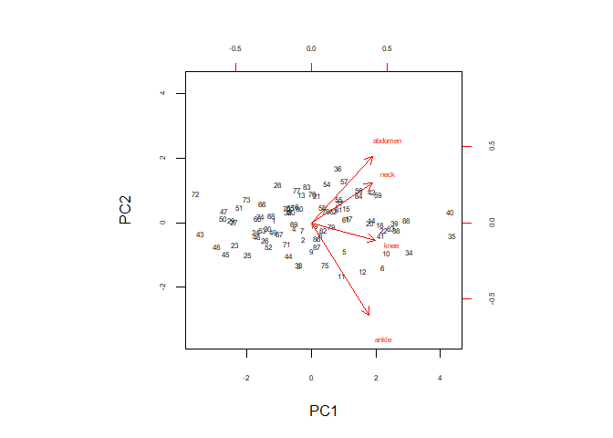

#### (2)Body fat data. The data consists of observations taken on a sample of 88 males. In this question you will look at PCA of the variables variables were measured:Neck circumference (cm) Abdomen circumference (cm) Knee circumference (cm) Ankle circumference (cm)

#### 2(a) Use pairs to construct a scatterplot matrix. Are there any outliers? If so, which cases are they?

    setwd("E:/maynooth/2nd_sem/ST464StatisticalMachineLearning/assignment/2")
    bfat <- read.table("bodyfat.txt", header=T)
    bfat <- bfat[,c("neck","abdomen", "knee", "ankle")]
    head(bfat)

    ##   neck abdomen knee ankle
    ## 1 36.2    85.2 37.3  21.9
    ## 2 38.5    83.0 37.3  23.4
    ## 3 34.0    87.9 38.9  24.0
    ## 4 37.4    86.4 37.3  22.8
    ## 5 34.4   100.0 42.2  24.0
    ## 6 39.0    94.4 42.0  25.6

    pairs(bfat)

    ## According to matrix plots, there exists outliers between following pairs
    ## a) knee and ankle 
    ## b) abdomen and ankle 
    ## 31 and 84 observation are outlier having high ankle value and influencing the linear relationship.

#### 2 (b) Carry out a principal components analysis of the data.What percentage of the variability in the dataset is accounted for by the first component? What percentage of the variability in the dataset is accounted for by the first two components? Examine the scree diagram and comment. (You will find the code for the screeplot in h1code.R).

    bfatpcom <- scale(bfat)
    head(bfatpcom)

    ##            neck    abdomen       knee      ankle
    ## [1,] -0.6459627 -0.5347747 -0.4349426 -0.5753430
    ## [2,]  0.3189292 -0.7366315 -0.4349426  0.1272035
    ## [3,] -1.5689027 -0.2870413  0.2863756  0.4082221
    ## [4,] -0.1425408 -0.4246709 -0.4349426 -0.1538151
    ## [5,] -1.4010954  0.8231714  1.7740944  0.4082221
    ## [6,]  0.5286883  0.3093540  1.6839296  1.1576051

    pc <- prcomp(bfatpcom)
    pc

    ## Standard deviations:
    ## [1] 1.6283179 0.8731395 0.5867784 0.4918329
    ## 
    ## Rotation:
    ##               PC1         PC2         PC3        PC4
    ## neck    0.5283837  0.21938447  0.76758486  0.2889543
    ## abdomen 0.5351101  0.35203936 -0.18875359 -0.7443773
    ## knee    0.5460990  0.05660109 -0.60799295  0.5735126
    ## ankle   0.3691120 -0.90814925  0.07436491 -0.1830058

    summary(pc)

    ## Importance of components:
    ##                           PC1    PC2     PC3     PC4
    ## Standard deviation     1.6283 0.8731 0.58678 0.49183
    ## Proportion of Variance 0.6629 0.1906 0.08608 0.06047
    ## Cumulative Proportion  0.6629 0.8535 0.93953 1.00000

    # The variability in data due to first component is 66.3 percent .
    # The variability in data due to first two components is 85.4 percent.
    source("screeplot.R")
    screeplot(pc)

    ## The screeplot shows 85 percent variation due to first two components of the data.

#### 2(c) What does the first component measure? the second component? Make a biplot to assist your interpretations. Are there any outliers? What can you say about the outliers from the plot?

    ## The first component measures overall fat component in (neck: 0.528 + abdomen: 0.535 + knee : 0.546 + ankle : 0.369) where variables are scaled . This component measures overall body fat .Ankel gets lower score than other variables.Here high score of component indicated high contribution in body fat.

    ## The second component gives most weight to abdomen.Therefore fatty males will have high score of abdomen fat.Negative and high value of ankle shows that for high value of ankle corresponds to lower body fat.

    ## Bi-plot to assist interpretation 
    biplot(pc, scale=0, cex=c(.5,.5), cex.axis=.5)

    ## The upper quarant have high value of PC1 and PC2 which means the components situated in this quadrant have high value corresponds to high value body fat.
    ## The components are abdomen,neck,knee have high contributaion in descending order.
    ## The arrows of abdomen,neck,knee are highly coreleated since they lie close to each other.
    ## components on right below quadrant have low value of pc1 and negative value of pc2 indicates low value of ankle have high value of knee and abdomen.

    ## There exist outlier(31 and 84) because as per pairs plot there should be linear relationship but for 31 and 84 obervation high ankle value have comparatively low value of knee and  abdomen. this is affecting the PCA results also.  

#### 2(d) Omiting any outliers identified, repeat parts (b) and (c).

    # Removing outlier
    head(bfat)

    ##   neck abdomen knee ankle
    ## 1 36.2    85.2 37.3  21.9
    ## 2 38.5    83.0 37.3  23.4
    ## 3 34.0    87.9 38.9  24.0
    ## 4 37.4    86.4 37.3  22.8
    ## 5 34.4   100.0 42.2  24.0
    ## 6 39.0    94.4 42.0  25.6

    nrow(bfat)

    ## [1] 88

    bfatout <- bfat[-c(31,84),]
    nrow(bfatout)

    ## [1] 86

    # Repeatition of part (b)
    pcout <- prcomp(bfatout,scale=TRUE)
    pcout

    ## Standard deviations:
    ## [1] 1.7186350 0.7186065 0.5801971 0.4396245
    ## 
    ## Rotation:
    ##               PC1        PC2        PC3        PC4
    ## neck    0.5002906  0.3230518  0.7567451  0.2695990
    ## abdomen 0.5005250  0.5460175 -0.3624786 -0.5656402
    ## knee    0.5251301 -0.1447403 -0.5198270  0.6580794
    ## ankle   0.4726758 -0.7593106  0.1603930 -0.4174913

    summary(pcout)

    ## Importance of components:
    ##                           PC1    PC2     PC3     PC4
    ## Standard deviation     1.7186 0.7186 0.58020 0.43962
    ## Proportion of Variance 0.7384 0.1291 0.08416 0.04832
    ## Cumulative Proportion  0.7384 0.8675 0.95168 1.00000

    # The variability in data due to first component is 73.84 percent .
    # The variability in data due to first two components is 86.75 percent.
    source("screeplot.R")
    screeplot(pcout)

    ## The screeplot shows 87 percent variation due to first two components of the data.

    # Repetition of part (c)

    ## The first component measures fat component in (neck: 0.5002 + abdomen: 0.5005 + knee : 0.5251 + ankle : 0.4726) where variables are scaled . This component measures overall body fat .Ankel gets lower score than other variables.Here high score of both component indicated high contribution in body fat.

    # Knee component have high value of PC1 but low value of PC2 .It means weightage is less.

    ## The second component gives most weight to abdomen.Therefore fatty males will have high score of abdomen fat.

    ## Bi-plot to assist interpretation 

    biplot(pcout, scale=0, cex=c(.5,.5), cex.axis=.5)

    ## The upper quarant have high value of PC1 and PC2 which means the components situated in this quadrant have high contributation to body fat.
    ## The components are abdomen,neck have high contributaion in descending order.
    ## The arrows of abdomen,neck are coreleated since they lie close to each other.

    ##components on right below quadrant have low value of pc1 and negative value of pc2 indicates low score for Knee and ankle component lies in this domain for high value of abdomen and neck and hence high body fat.

    ## There exist no outlier.

#### 4 (a) (a) We have a set of data on 500 worldwide tech firms. For each firm, information on profit, CEO salary, number of employees, average employee salary, and home country is recorded. We are interested in the relationship between CEO salary and other measurements.

#### (i) Is it a classification or regression problem?

    # Statistical learning methods are mostly selected on the basis whether response is qualitative or quantatitive.
    # Here ,response is quantitative variable.Therfore its regression problem.

#### (ii) Are we most intererest in inference or prediction?

    # Since we are interested in understanding the relationship between response and predictors.Therefore it is inference .

#### (iii) Provide n and p.For each predictor described state whether it is categorical or quantitative.

    # n=500 and p=4
    # Profit ,number of employee,average employee salary are quantitative while home country is categorical.

#### (iv) Indicate whether we would expect the performance of a flexible learning method to be better or worse than an inflexible method.

    #Inflexible method is better to understand the relationship between response and predictors.

#### 4(b) A company wishes to launch a new product. They want to know in advance whether it will be a success or failure. They collect data on 20 similar products, and record whether they succeeded or not, price charged, marketing budget, and 10 other variables.

#### (i) Is it a classification or regression problem?

    # Here Response is qualitative variable.Therefore It is classification problem.

#### (ii) Are we most intererest in inference or prediction?

    # Here Company is not willing to understand deeper relationship between individual predictors and responses.Instead company wants to predict accurate model to predict the success of product. This is prediction problem.

#### (iii) Provide n and p.For each predictor described state whether it is categorical or quantitative.

    # n=20 and p=12 
    # Price charged and marketing budget is qualitative variable.

#### (iv) Indicate whether we would expect the performance of a flexible learning method to be better or worse than an inflexible method

    #flexible
    # We would expect the performance better in flexible learning method becaue we are interested only in predicting the output as success or failure of product.

#### 4(c) A dataset was collected to related the birthweight of babies to the days of gestation and gender.

#### (i) Is it a classification or regression problem?

    # Here response is quantiative and hence It belongs to regression problem category.

#### (ii) Are we most intererest in inference or prediction?

    # In this problem, we want to understand the relation between birthweight with days of gestation and gender.This is inference problem.

#### (iii) Provide n and p.For each predictor described state whether it is categorical or quantitative.

    # p=2 ,n depends on samples taken for study.
    # Days of gestation is quantitative while Gender is categorical or qualitative.

#### (iv)Indicate whether we would expect the performance of a flexible learning method to be better or worse than an inflexible method

    # We would expect the performance better in inflexible learning method since we are interested in finding relation.

#### (d) Observations were collected on 56 attributes from 32 lung cancer patients belonging to one of 3 classes.

#### (i) Is it a classification or regression problem?

    # In this case response variable is qualitative .Hence it is classification problem.

#### (ii) Are we most intererest in inference or prediction?

    # This is prediction problem because problem is to predict whether the patients belong to cancer category or not.

#### (iii) Provide n and p.For each predictor described state whether it is categorical or quantitative.

    # n=32 p=56 
    # All predictors may be categorical or continuous.

#### (iv) Indicate whether we would expect the performance of a flexible learning method to be better or worse than an inflexible method

    #flexible
    # We would expect the performance better in flexible learning method because we are interested in predicting the patients category based on its attributes.

#### (5)In this exercise you will conduct an experiment to compare the fits on a linear and flexible model fit. You will use the Auto data from the package ISLR and explore the relationship between the response mpg with weight and horsepower.

#### (a)Plot the response (miles per gallon) vs weight and horsepower. What do they tell you about the relationship between mpg and the predictors?

    library("ISLR")

    ## Warning: package 'ISLR' was built under R version 3.3.3

    head(Auto)

    ##   mpg cylinders displacement horsepower weight acceleration year origin
    ## 1  18         8          307        130   3504         12.0   70      1
    ## 2  15         8          350        165   3693         11.5   70      1
    ## 3  18         8          318        150   3436         11.0   70      1
    ## 4  16         8          304        150   3433         12.0   70      1
    ## 5  17         8          302        140   3449         10.5   70      1
    ## 6  15         8          429        198   4341         10.0   70      1
    ##                        name
    ## 1 chevrolet chevelle malibu
    ## 2         buick skylark 320
    ## 3        plymouth satellite
    ## 4             amc rebel sst
    ## 5               ford torino
    ## 6          ford galaxie 500

    Auto <-Auto[complete.cases(Auto[,c(1,4,5)]),] # to remove NAs 
    head(Auto)

    ##   mpg cylinders displacement horsepower weight acceleration year origin
    ## 1  18         8          307        130   3504         12.0   70      1
    ## 2  15         8          350        165   3693         11.5   70      1
    ## 3  18         8          318        150   3436         11.0   70      1
    ## 4  16         8          304        150   3433         12.0   70      1
    ## 5  17         8          302        140   3449         10.5   70      1
    ## 6  15         8          429        198   4341         10.0   70      1
    ##                        name
    ## 1 chevrolet chevelle malibu
    ## 2         buick skylark 320
    ## 3        plymouth satellite
    ## 4             amc rebel sst
    ## 5               ford torino
    ## 6          ford galaxie 500

    plot(Auto$horsepower,Auto$mpg)

    plot(Auto$weight,Auto$mpg)

    plot(Auto$horsepower+Auto$weight,Auto$mpg,type="p",xlab="weight and horsepower",ylab="miles per gallon")

    #  Miles per gallon decreases as weight and horse power increases.

#### (b) Make a 3d plot of weight, horsepower and mpg (see commands above). What do they tell you about the relationship between mpg and the predictors?

    library(plot3D)

    ## Warning: package 'plot3D' was built under R version 3.3.3

    scatter3D(Auto$weight,Auto$horsepower,Auto$mpg)

    library(plot3Drgl)

    ## Warning: package 'plot3Drgl' was built under R version 3.3.3

    ## Loading required package: rgl

    ## Warning: package 'rgl' was built under R version 3.3.3

    scatter3Drgl(Auto$weight,Auto$horsepower,Auto$mpg)
    ## interpretation
    ## 3D plot contains predictors on x and y axis and response on z axis.
    ## Miles per gallon decreases as weight and horse power increases. z axis represents miles per gallon while x axis represents weight and y axis represents horsepower.
    ## Using this plot we only view actual data values with no interpolation between data points.

#### (c) Next, divide the data into a training set and a test set as follows:Fit a linear regression model to mpg versus weight and horsepower on AutoTrain. Call the fit f1. Examine summary(f1) and comment on the significance of the predictors.

    set.seed(123)
    train <- sample(nrow(Auto), round(.8*nrow(Auto)))
    head(train)

    ## [1] 113 309 160 344 365  18

    AutoTrain <- Auto[train,]
    head(AutoTrain)

    ##      mpg cylinders displacement horsepower weight acceleration year origin
    ## 114 21.0         6          155        107   2472         14.0   73      1
    ## 311 38.1         4           89         60   1968         18.8   80      3
    ## 162 16.0         6          250        105   3897         18.5   75      1
    ## 348 37.0         4           85         65   1975         19.4   81      3
    ## 370 34.0         4          112         88   2395         18.0   82      1
    ## 18  21.0         6          200         85   2587         16.0   70      1
    ##                          name
    ## 114          mercury capri v6
    ## 311     toyota corolla tercel
    ## 162 chevroelt chevelle malibu
    ## 348            datsun 210 mpg
    ## 370 chevrolet cavalier 2-door
    ## 18              ford maverick

    AutoTest <- Auto[-train,]
    head(AutoTest)

    ##    mpg cylinders displacement horsepower weight acceleration year origin
    ## 2   15         8          350        165   3693         11.5   70      1
    ## 4   16         8          304        150   3433         12.0   70      1
    ## 12  14         8          340        160   3609          8.0   70      1
    ## 13  15         8          400        150   3761          9.5   70      1
    ## 15  24         4          113         95   2372         15.0   70      3
    ## 17  18         6          199         97   2774         15.5   70      1
    ##                     name
    ## 2      buick skylark 320
    ## 4          amc rebel sst
    ## 12    plymouth 'cuda 340
    ## 13 chevrolet monte carlo
    ## 15 toyota corona mark ii
    ## 17            amc hornet

    plot(AutoTrain$weight+AutoTrain$horsepower,AutoTrain$mpg,xlab="Weight+horsepower",ylab="mpg")

    f1 <- lm(AutoTrain$mpg ~ AutoTrain$weight+AutoTrain$horsepower)
    summary(f1)

    ## 
    ## Call:
    ## lm(formula = AutoTrain$mpg ~ AutoTrain$weight + AutoTrain$horsepower)
    ## 
    ## Residuals:
    ##      Min       1Q   Median       3Q      Max 
    ## -11.4101  -2.7431  -0.4644   2.5079  16.0258 
    ## 
    ## Coefficients:
    ##                        Estimate Std. Error t value Pr(>|t|)    
    ## (Intercept)          46.1626326  0.8950964   51.57  < 2e-16 ***
    ## AutoTrain$weight     -0.0060579  0.0005553  -10.91  < 2e-16 ***
    ## AutoTrain$horsepower -0.0431712  0.0120932   -3.57 0.000414 ***
    ## ---
    ## Signif. codes:  0 '***' 0.001 '**' 0.01 '*' 0.05 '.' 0.1 ' ' 1
    ## 
    ## Residual standard error: 4.339 on 311 degrees of freedom
    ## Multiple R-squared:  0.7087, Adjusted R-squared:  0.7068 
    ## F-statistic: 378.3 on 2 and 311 DF,  p-value: < 2.2e-16

    # both the predictors are significant as p-value is less than  0.05 and its coefficients are ( -0.0060579,-0.0431712) negative which means that there exists inverse relation between response and predictor.

#### (d) Plot the fitted surface and the data. (See lecture notes for code). Does the linear surface look like a good fit?

    attach(AutoTrain)
    library(plot3D)
    library(plot3Drgl)
    f1 <- lm(mpg~weight+horsepower,data=AutoTrain)
    wt1 <- seq(1613, 5140, length.out = 50)
    disp1 <- seq(46, 230, length.out = 50)
    pred <- predict(f1, expand.grid(weight=wt1, horsepower=disp1))
    pred <- matrix(pred,50,50)
    scatter3D(weight, horsepower, mpg, pch = 18,surf = list(x = wt1, y = disp1, z = pred))

    # It does not seem to be good fit.

#### (e) Use loess to fit a surface to the same data. Call the fit f2. Plot the fitted surface and the data. Does the loess surface look like a good fit?

    library(plot3D)
    library(plot3Drgl)
    f2 <- loess(mpg~weight+horsepower,data=AutoTrain)
    wt1 <- seq(1600, 5200, length.out = 50)
    disp1 <- seq(40, 250, length.out = 50)
    pred <- predict(f2, expand.grid(weight=wt1,horsepower=disp1))
    pred <- matrix(pred,50,50)
    scatter3D(weight, horsepower, mpg, pch = 18,surf = list(x = wt1, y = disp1, z = pred))

    ## Loess fit looks better.

#### (f)Calculate the MSE for both fits on the training data. What do these numbers tell you? (See lecture notes for code.)

    r1 <- residuals(f1)
    mse_firstfit <- mean(r1^2)
    mse_firstfit

    ## [1] 18.64557

    r2 <- residuals(f2)
    mse_secondfit <- mean(r2^2)
    mse_secondfit 

    ## [1] 16.12921

    # MSE for loess fit is smaller than linear fit.The second fit is good fit compared to first fit.

#### (g) Calculate the MSE for both fits on the test data. What do these numbers tell you?

    f3 <- lm(mpg ~ weight+horsepower,data=AutoTest)
    r3 <- residuals(f3)
    mse_ftd<- mean(r3^2)
    mse_ftd

    ## [1] 13.52707

    f4 <- loess(mpg~weight+horsepower,data=AutoTest)
    r4 <- residuals(f4)
    mse_std <- mean(r4^2)
    mse_std

    ## [1] 9.690132

    # MSE for test data are lower than training data for both type of fits.
    # MSE for loess is smaller than MSE for plane fit. It seems loess fit is good as compared with regression fit.

